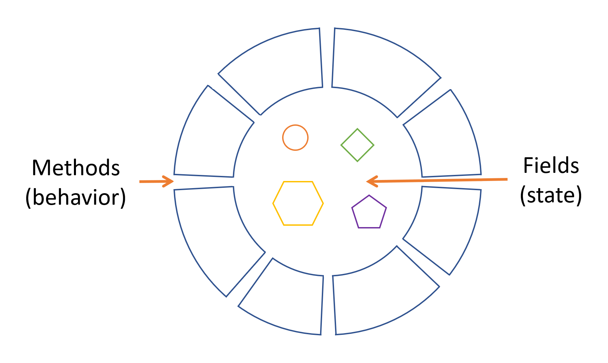
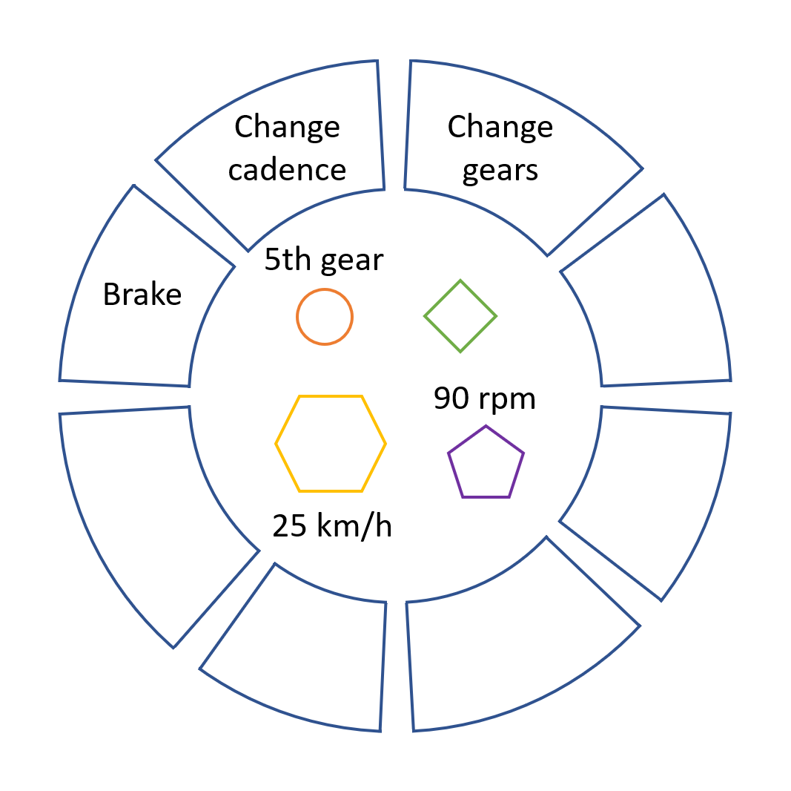

# What is an object
An object is a software bundle of related state and behavior.

Objects share two characteristics: state and behavior.
Dogs have state (name, color, breed, hungry) and behavior (barking, fetching, wagging tail).
Bicycles have state (current gear, cadence, speed) and behavior (change gear, brake, turn).
Identifying state and behavior of real-world objects is a good start for object-oriented thinking.

Software objects consist of related state and behavior. An object stores its state in fields 
and exposes its behavior through methods. Methods operate on object's internal state and serve
as the primary mechanism for object to object communication. Hiding internal state and 
requiring all interaction to complete through the methods is called **encapsulation** - 
that's one of the fundamental principles of OOP.

Take an example of a bicycle:

By exposing its contents with methods, the object remains in control of how the outside world
is allowed to use it. Without a method to set a gear, we can specify any value into it. But with a 
method, we can reject any value that is less than 1, or greater than 6, if bike has 6 gears.

Bundling code in software objects comes with following benefits:
1. Modularity: The source code of one object can easily be maintained and modified independently of the other objects. Once created, an object can be easily passed around inside the system.
2. Information-hiding: By interacting with an object's methods, the details of internal implementation remain hidden from the outside world.
3. Code re-use: If someone already written an object, you can trust and reuse it in your own code.
4. Pluggability and debugging ease: once one object breaks, you can replace it and continue. No need to rewrite whole codebase.
