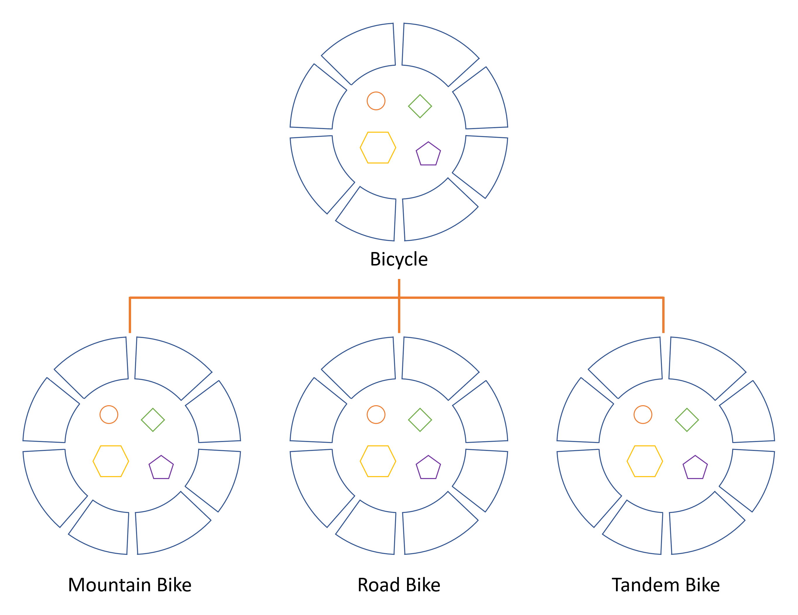

# What is inheritance

Different kinds of objects often have a certain amount of common with each other.
Mountain bikes, road bikes, tandem bikes - all share the characteristics of a bicycle.
Yet each also defines additional features that make them different: mountain bikes may have more 
gears, road bikes have drop bars, tandem bikes have two sets of handlebars and saddles.

Object oriented-programming allows us to inherit commonly used state and behavior from other 
classes. In this example, Bicycle now becomes a superclass of MountainBike, RoadBike, TandemBike.
In the Java, each class is allowed to inherit a single superclass. And each superclass can have
potentially unlimited number of subclasses:



To inherit a class, just specify a keyword 'extends' and the target class:
```java
class MountainBike extends Bicycle {
  // new fields and methods here
}
```

This gives `MountainBike` all the same fields and methods as `Bicycle`, yet allows its code 
to focus specifically on the features that make it unique.
